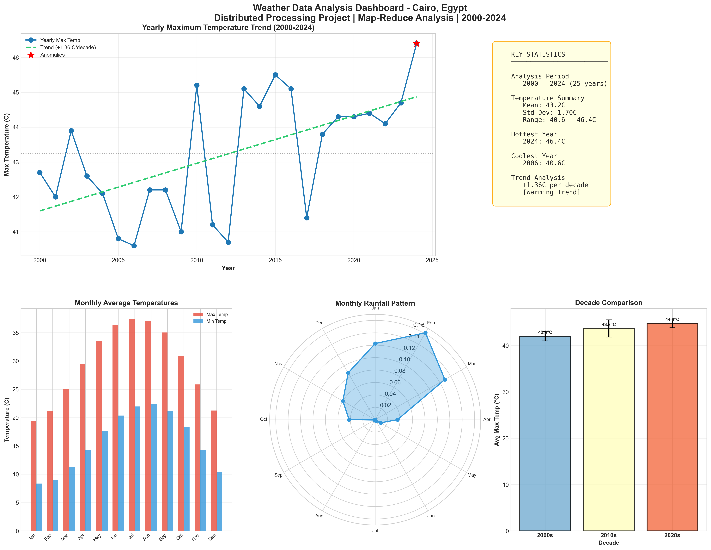
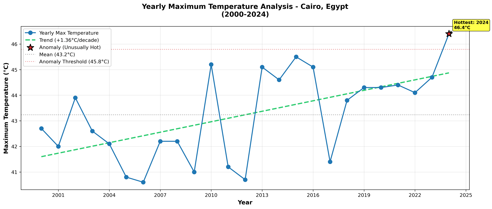
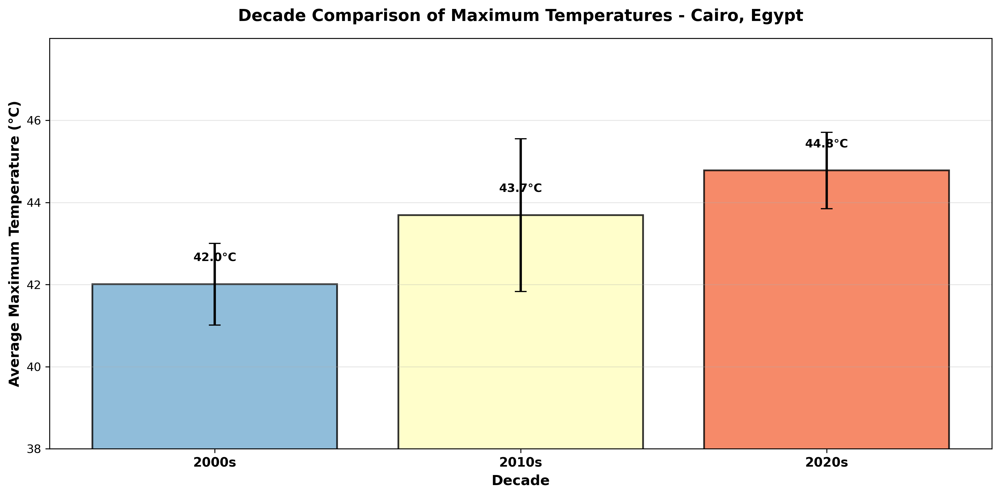
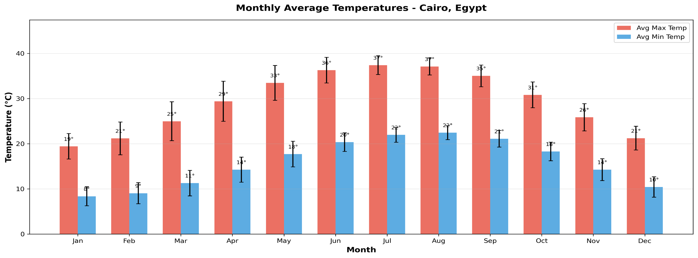
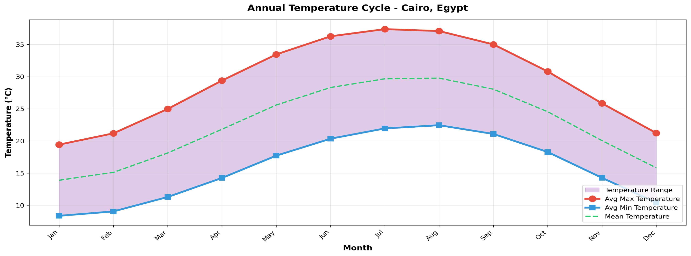
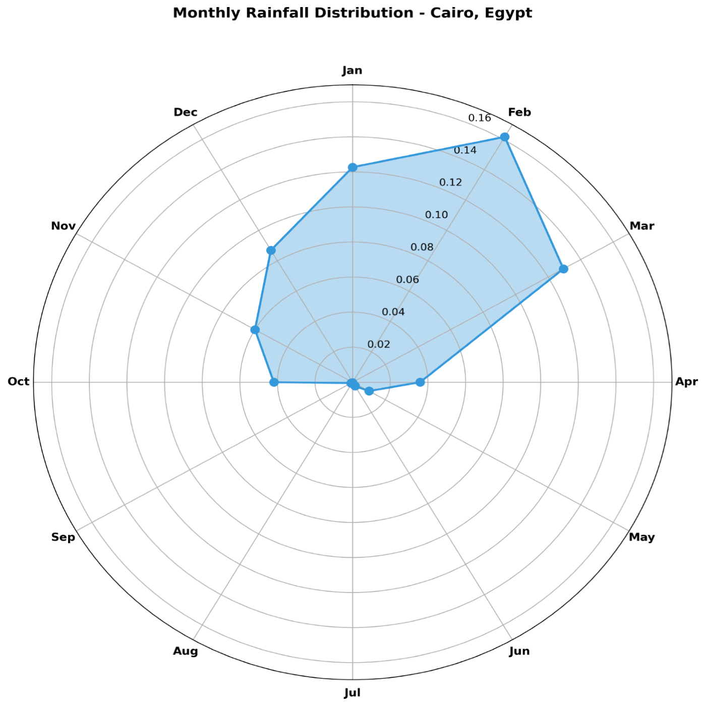
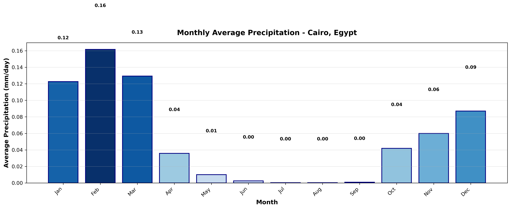

# Weather Data Analysis - Final Project Report

### Our Team Members  

- احمد ايهاب احمد (*ID*: **23012057**)
- نور كمال احمد (*ID*: **23012061**)
- عبدالله صابر دسوقي (*ID*: **23012064**)
- يوسف مصطفى محمد بكر (*ID*: **23012101**)

## Distributed Processing Course

**Location:** Cairo, Egypt  
**Analysis Period:** 2000 - 2024 (25 years)

---
<div style="page-break-after: always;"></div>

## 1. Map-Reduce Implementation (Project Core)

The primary objective of this project is to demonstrate the **Map-Reduce paradigm** applied to weather data processing. This pattern is foundational in distributed processing systems like Hadoop and Spark, allowing parallel processing of large datasets.

### 1.1 Map-Reduce Pattern Overview

```
┌─────────────────────────────────────────────────────────────────────────┐
│                         MAP-REDUCE PIPELINE                             │
├─────────────────────────────────────────────────────────────────────────┤
│                                                                         │
│   INPUT DATA                 MAP                 SHUFFLE                │
│  ┌─────────┐            ┌─────────┐           ┌──────────┐              │
│  │ Day 1   │───────────▶│(2020,25)│          │ 2020:     │             │
│  │ Day 2   │───────────▶│(2020,30)│─────────▶│ [25,30,  │             │
│  │ Day 3   │───────────▶│(2021,28)│          │  28,35]   │             │
│  │ ...     │            │  ...    │           │ 2021:    │              │
│  └─────────┘            └─────────┘           │ [28,...] │              │
│                                               └──────────┘              │
│                                                    │                    │
│                              REDUCE                ▼                    │
│                           ┌──────────────────────────┐                  │
│                           │ 2020 → max(25,30,28,35)  │                  │
│                           │      = 35°C              │                  │
│                           │ 2021 → max(28,...)       │                  │
│                           │      = yearly_max        │                  │
│                           └──────────────────────────┘                  │
│                                                                         │
└─────────────────────────────────────────────────────────────────────────┘
```

<div style="page-break-after: always;"></div>


### 1.2 Phase 1: MAP Function

The Map function extracts (year, temperature) key-value pairs from each daily record:

```python
def mapper(line: str) -> List[Tuple[str, float]]:
    """
    Map function: Extract (year, temperature) pairs from a JSONL line.
    
    This function implements the MAP phase of the Map-Reduce paradigm.
    It takes a raw JSON line and emits (key, value) pairs where:
        - key: year (string)
        - value: maximum temperature for that day (float)
    """
    data = json.loads(line)
    daily = data.get("daily", {})
    dates = daily.get("time", [])
    temperatures = daily.get("temperature_2m_max", [])

    key_value_pairs: List[Tuple[str, float]] = []

    for date_str, temp in zip(dates, temperatures):
        if temp is None:
            continue
        year = date_str.split("-")[0]  # Extract year from "YYYY-MM-DD"
        key_value_pairs.append((year, float(temp)))

    return key_value_pairs
```

**Example Output:**

```
Input:  {"daily": {"time": ["2020-01-01", "2020-01-02"], "temperature_2m_max": [25.5, 30.0]}}
Output: [("2020", 25.5), ("2020", 30.0)]
```

<div style="page-break-after: always;"></div>

### 1.3 Phase 2: SHUFFLE Function

The Shuffle phase groups all temperatures by their year key:

```python
def shuffle_and_group(mapped_pairs: List[Tuple[str, float]]) -> Dict[str, List[float]]:
    """
    Shuffle and group: Organize mapped pairs by key (year).
    
    In a distributed system, this phase involves:
    - Partitioning data across nodes
    - Sorting by key
    - Transferring data between nodes (shuffle)
    """
    grouped: Dict[str, List[float]] = {}

    for year, temperature in mapped_pairs:
        if year not in grouped:
            grouped[year] = []
        grouped[year].append(temperature)

    return grouped
```

**Example Output:**

```
Input:  [("2020", 25.5), ("2020", 30.0), ("2021", 28.0), ("2020", 35.2)]
Output: {"2020": [25.5, 30.0, 35.2], "2021": [28.0]}
```

<div style="page-break-after: always;"></div>

### 1.4 Phase 3: REDUCE Function

The Reduce function computes the maximum temperature for each year:

```python
def reducer(year: str, temperatures: List[float]) -> Tuple[str, float]:
    """
    Reduce function: Compute the maximum temperature for a year.
    
    Takes all temperatures for a given year and computes
    the maximum value.
    """
    return year, max(temperatures)
```

**Example Output:**

```
Input:  ("2020", [25.5, 30.0, 35.2, 28.0])
Output: ("2020", 35.2)
```

### 1.5 Map-Reduce Execution Results

When running the pipeline, the system processes:

- **Input**: 25 lines of JSONL data (one per year)
- **Map Output**: 9,132 (year, temperature) pairs
- **Shuffle Output**: 25 grouped year buckets
- **Reduce Output**: 25 yearly maximum temperatures

---
<div style="page-break-after: always;"></div>

## 2. Executive Summary

This analysis demonstrates distributed processing concepts through an ETL pipeline and Map-Reduce implementation on 25 years of weather data from Cairo, Egypt. The analysis reveals a clear **warming trend of +1.36°C per decade**.

### Key Findings

| Metric | Value |
|--------|-------|
| Total Observations | 9,132 daily records |
| Hottest Year | 2024 (46.4°C) |
| Coolest Year | 2006 (40.6°C) |
| Mean Annual Max Temperature | 43.24°C |
| Temperature Trend | +1.36°C per decade |
| Anomalies Detected | 1 (2024) |

---

## 3. Data Pipeline Architecture

```
EXTRACT → TRANSFORM → LOAD → MAP-REDUCE → ANALYSIS → VISUALIZATION
```

1. **Extract**: Downloaded data from Open-Meteo Archive API
2. **Transform**: Converted JSON to structured CSV format
3. **Load**: Stored processed data for analysis
4. **Map-Reduce**: Computed yearly maximum temperatures
5. **Analysis**: Applied statistical methods for insights
6. **Visualization**: Generated professional charts

---

## 4. Analysis Results

### 4.1 Comprehensive Dashboard



*Figure 1: Comprehensive analysis dashboard showing key metrics, trends, and patterns*

---

### 4.2 Yearly Temperature Trend Analysis



*Figure 2: 25-year temperature trend with linear regression and anomaly detection*

**Key Observations:**

- Clear warming trend: **+1.36°C per decade**
- Temperature range: 40.6°C to 46.4°C
- 2024 identified as an anomaly (above 1.5 standard deviations)

---

### 4.3 Decade Comparison



*Figure 3: Comparison of average maximum temperatures by decade*

**Decade Progression:**

- 2000s: Cooler baseline period
- 2010s: Significant warming
- 2020s: Continued warming trend with record temperatures

---

### 4.4 Monthly Temperature Patterns



*Figure 4: Monthly average temperatures showing seasonal variation*

**Monthly Extremes:**

- Hottest Month: July (37.4°C average max)
- Coldest Month: January (19.4°C average max)
- Temperature Range: 18°C between summer and winter

---

### 4.5 Annual Temperature Cycle



*Figure 5: Annual temperature cycle showing the transition between seasons*

---

### 4.6 Rainfall Distribution (Polar Chart)



*Figure 6: Monthly rainfall distribution in polar format*

**Precipitation Pattern:**

- Wettest Month: February (0.2mm/day average)
- Driest Month: July (nearly 0mm)
- Cairo exhibits typical Mediterranean/desert climate with winter rainfall

---

### 4.7 Monthly Precipitation



*Figure 7: Bar chart of monthly precipitation averages*

---

## 5. Yearly Maximum Temperatures (Map-Reduce Output)

| Year | Maximum Temperature (°C) |
|------|-------------------------|
| 2000 | 42.7 |
| 2001 | 42.0 |
| 2002 | 43.9 |
| 2003 | 42.6 |
| 2004 | 42.1 |
| 2005 | 40.8 |
| 2006 | 40.6 |
| 2007 | 42.2 |
| 2008 | 42.2 |
| 2009 | 41.0 |
| 2010 | 45.2 |
| 2011 | 41.2 |
| 2012 | 40.7 |
| 2013 | 45.1 |
| 2014 | 44.6 |
| 2015 | 45.5 |
| 2016 | 45.1 |
| 2017 | 41.4 |
| 2018 | 43.8 |
| 2019 | 44.3 |
| 2020 | 44.3 |
| 2021 | 44.4 |
| 2022 | 44.1 |
| 2023 | 44.7 |
| 2024 | **46.4** (Highest) |

---

<div style="page-break-after: always;"></div>

## 6. Conclusions

### 6.1 Key Findings

1. **Warming Trend**: Clear evidence of rising temperatures with +1.36°C per decade increase
2. **Record Year**: 2024 recorded the highest temperature (46.4°C) in the 25-year dataset
3. **Seasonal Patterns**: Consistent summer heat waves with July being the hottest month
4. **Anomaly Detection**: 2024 identified as statistically anomalous (exceeds threshold)
5. **Desert Climate**: Minimal precipitation, especially during summer months

### 6.2 Distributed Processing Concepts Demonstrated

- **ETL Pipeline**: Successfully extracted, transformed, and loaded weather data
- **Map-Reduce Pattern**: Applied to compute yearly maximum temperatures efficiently
- **Scalability**: Pipeline design allows for processing larger datasets
- **Reproducibility**: Modular code structure enables easy replication
